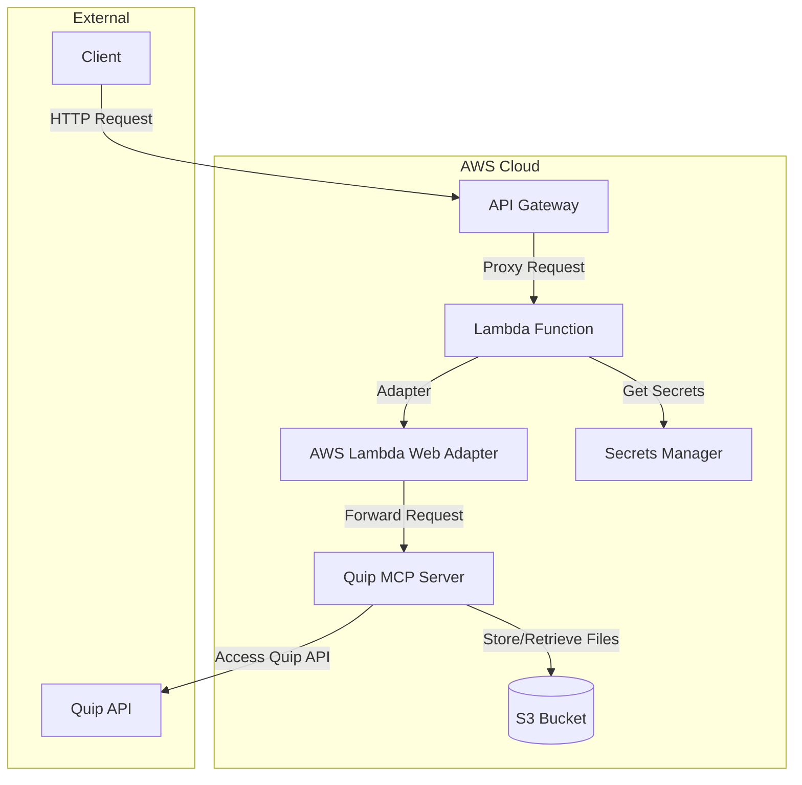

# Quip MCP Server on AWS Lambda

This project contains the AWS CDK infrastructure code to deploy the quip-mcp-server-typescript project on AWS Lambda with API Gateway.

## Architecture Overview

The architecture consists of the following components:

1. **AWS Lambda Function**: Hosts the Quip MCP server using AWS Lambda Web Adapter to convert API Gateway requests to HTTP requests.
2. **API Gateway**: Provides the HTTP endpoint for clients to interact with the MCP server.
3. **S3 Bucket**: Stores the CSV files exported from Quip spreadsheets.
4. **AWS Secrets Manager**: Stores sensitive information like the Quip API token.

## Architecture Diagram



## Prerequisites

Before deploying this project, you need to have the following:

1. AWS CLI installed and configured with appropriate credentials
2. Node.js 20.x or later
3. A Quip API token

## Project Structure

```
infrastructure/
├── api-gateway-lambda/   # CDK project
│   ├── bin/
│   │   └── app.ts        # CDK app entry point
│   ├── lib/
│   │   └── quip-mcp-server-stack.ts  # Main CDK stack
│   ├── lambda/           # Lambda function code
│   │   ├── run.js        # Lambda handler
│   │   └── package.json
│   ├── package.json
│   └── tsconfig.json
└── README.md
```

## Deployment Instructions

### 1. Install Dependencies

First, install the dependencies for the CDK project:

```bash
cd infrastructure/api-gateway-lambda
npm install
```

### 2. Bootstrap AWS Environment (First Time Only)

If you haven't used CDK in your AWS account before, you need to bootstrap it:

```bash
npx cdk bootstrap
```

### 3. Configure Secrets

Before deploying, you need to create a secret in AWS Secrets Manager with the following values:

- `QUIP_TOKEN`: Your Quip API token
- `QUIP_BASE_URL`: The base URL for the Quip API (optional, defaults to `https://platform.quip.com/`)

You can create this secret manually in the AWS Console or use the AWS CLI:

```bash
aws secretsmanager create-secret \
    --name quip-mcp-server/secrets \
    --description "Secrets for Quip MCP Server" \
    --secret-string '{"QUIP_TOKEN":"your-quip-api-token","QUIP_BASE_URL":"your-quip-base-url-if-needed"}'
```

### 4. Deploy the CDK Stack

Deploy the CDK stack to your AWS account:

```bash
cd infrastructure/api-gateway-lambda
npx cdk deploy
```

This command will:
1. Synthesize the CloudFormation template
2. Deploy the stack to your AWS account
3. Output the API Gateway URL and API Key ID

### 5. Retrieve the API Key

After deployment, you need to retrieve the API key value from AWS Console or using the AWS CLI:

```bash
aws apigateway get-api-key \
    --api-key YOUR_API_KEY_ID \
    --include-value
```

Replace `YOUR_API_KEY_ID` with the API Key ID from the CDK output.

## Using the Deployed MCP Server

To use the deployed MCP server, you need to:

1. Use the API Gateway URL from the CDK output
2. Include the API key in the `X-API-Key` header of your requests
3. Send POST requests to the `/mcp` endpoint

Example:

```bash
curl -X POST \
    -H "Content-Type: application/json" \
    -H "Accept: application/json, text/event-stream" \
    -H "X-API-Key: YOUR_API_KEY_VALUE" \
    -d '{
      "jsonrpc": "2.0",
      "id": "1",
      "method": "tools/call",
      "params": {
        "name": "quip_read_spreadsheet",
        "arguments": {
          "threadId": "YOUR_THREAD_ID"
        }
      }
    }' \
    https://your-api-gateway-url/mcp
```

## Monitoring and Troubleshooting

You can monitor your Lambda function and API Gateway using AWS CloudWatch:

1. Lambda logs are available in CloudWatch Logs
2. API Gateway metrics are available in CloudWatch Metrics
3. You can set up CloudWatch Alarms for error rates and latency

## Cleanup

To remove all resources created by this CDK stack:

```bash
cd infrastructure/api-gateway-lambda
npx cdk destroy
```

Note: This will not delete the S3 bucket contents or the Secrets Manager secret due to the retention policy. You need to delete them manually if required.

## Security Considerations

1. The API Gateway is protected with an API key
2. Sensitive information is stored in Secrets Manager
3. The S3 bucket is encrypted with SSE-S3
4. The Lambda function has minimal IAM permissions

## Cost Optimization

1. The Lambda function is configured with 1024MB of memory
2. S3 lifecycle rules delete objects after 180 days
3. Consider using provisioned concurrency for consistent performance if needed
