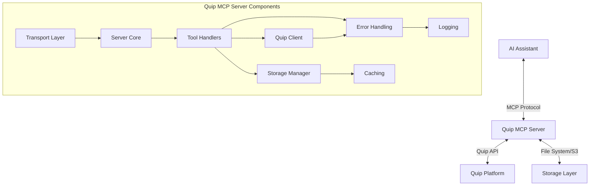

# System Patterns: Quip MCP Server

## System Architecture

The Quip MCP Server follows a modular architecture with clear separation of concerns, organized around the Model Context Protocol (MCP) standard. The architecture enables the server to act as a bridge between AI systems and Quip spreadsheet data.



### Core Components

1. **Transport Layer**
   - Handles communication protocols (stdio, HTTP)
   - Manages request/response formatting
   - Implements appropriate security for each transport
   - Automatically selects transport based on environment

2. **Server Core**
   - Implements the MCP protocol
   - Registers capabilities, tools, and resources
   - Routes requests to appropriate handlers
   - Manages resource URI resolution

3. **Tool Handlers**
   - Implements the specific tool logic (e.g., quip_read_spreadsheet)
   - Processes input parameters
   - Formats response data
   - Handles error conditions gracefully

4. **Storage Manager**
   - Abstract interface with multiple implementations (LocalStorage, S3Storage)
   - Handles persistence of spreadsheet data
   - Manages file paths and naming conventions
   - Provides flexible resource URI generation
   - Implements caching for improved performance

5. **Quip Client**
   - Interacts with the Quip API
   - Handles authentication
   - Implements primary export functionality (XLSX)
   - Provides fallback extraction method (HTML parsing)
   - Validates document types and spreadsheet formats

6. **Auxiliary Systems**
   - Error handling with hierarchical error types
   - Dual caching for content and metadata
   - Structured logging with configurable formats
   - Command-line interface for configuration

## Key Technical Decisions

### TypeScript Implementation
- Provides strong typing for better code quality and maintainability
- Enables better IDE support and code navigation
- Facilitates easier onboarding for new developers
- Clear interfaces define component boundaries

### Dual Transport Support
- **Stdio Transport**: For integration with AI platforms that launch the server as a subprocess
- **HTTP Transport**: For standalone operation and remote access
- Automatic selection based on environment variables
- Decision allows maximum flexibility for different deployment scenarios

### Flexible Storage Architecture
- **Abstract StorageInterface**: Defines common operations regardless of backend
- **LocalStorage**: File system implementation for local deployments
- **S3Storage**: AWS S3 implementation for cloud deployments
- Factory pattern for creating appropriate implementation
- Consistent URI generation across storage types

### Caching Strategy
- In-memory caching for frequently accessed resources
- Separate caches for content and metadata with different TTLs
- Key-based lookup using thread ID and sheet name combinations
- Cache invalidation on content updates

### Error Handling Approach
- Hierarchical error types for specific error scenarios
- Consistent error formatting for actionable feedback
- Detailed logging for troubleshooting
- Graceful fallback mechanisms when primary methods fail

### Authentication Mechanisms
- API key authentication for HTTP transport
- Environment variables for sensitive credentials
- Optional automatic API key generation
- Secured storage of API tokens

## Design Patterns in Use

### Factory Pattern
Used in the storage implementation to create the appropriate storage instance based on configuration:

```typescript
export function createStorage(storageType: string, options: StorageOptions): StorageInterface {
  // Export the storage type to environment for other components to check
  process.env.STORAGE_TYPE = storageType;
  
  logger.info(`Creating storage implementation for type: ${storageType}`);
  
  if (storageType === 'local') {
    return new LocalStorage(options.storagePath, options.isFileProtocol);
  } else if (storageType === 's3') {
    if (!options.s3Bucket) {
      throw new Error('S3 bucket name is required for S3 storage');
    }
    if (!options.s3Region) {
      throw new Error('S3 region is required for S3 storage');
    }
    
    return new S3Storage(
      options.s3Bucket,
      options.s3Region,
      options.s3Prefix || '',
      options.s3UrlExpiration || 3600
    );
  }
  throw new Error(`Unsupported storage type: ${storageType}`);
}
```

### Strategy Pattern
Implemented for transport selection, allowing different communication protocols:

```typescript
// Choose transport based on options
if (options.port || process.env.PORT) {
  // Using Streamable HTTP transport with Express
  const port = options.port || parseInt(process.env.PORT || '3000', 10);
  logger.info(`Using HTTP transport on port ${port}`);
  
  // Create Express app
  const app = express();
  app.use(express.json());
  
  // Handle POST requests for client-to-server communication
  app.post('/mcp', async (req: Request, res: Response) => { ... });
} else {
  // Using stdio transport
  logger.info("Using stdio transport");
  const transport = new StdioServerTransport();
  
  // Connect to the transport - this will block for stdio
  logger.info("Connecting to transport");
  await server.connect(transport);
}
```

### Adapter Pattern
Used in the QuipClient to adapt the Quip API to the MCP server's needs, with multiple extraction methods:

```typescript
export class QuipClient {
  // Primary extraction method
  async exportThreadToXLSX(threadId: string, outputPath: string): Promise<string> {...}
  
  // Fallback extraction method
  async exportThreadToCSVFallback(threadId: string, sheetName?: string): Promise<string> {...}
  
  // Validation method
  async isSpreadsheet(threadId: string): Promise<boolean> {...}
}
```

### Singleton Pattern
Applied to logging and cache instances that should be shared across the application:

```typescript
// Created once and imported where needed
export const logger = createLogger();
export const csvCache = new LRUCache<string, string>(50, 10 * 60 * 1000); // 10 minutes TTL
export const metadataCache = new LRUCache<string, Record<string, any>>(100, 30 * 60 * 1000); // 30 minutes TTL
```

### Command Pattern
Structured approach to handling CLI arguments with clear separation of parsing and execution:

```typescript
export function parseCommandLineArgs(): CommandLineOptions {
  // Using commander.js to parse command line arguments
  const program = new Command();
  program
    .option('--storage-path <path>', 'Path to store CSV files')
    .option('--file-protocol', 'Use file protocol for resource URIs')
    .option('--storage-type <type>', 'Storage type (local or s3)', 'local')
    .option('--s3-bucket <bucket>', 'S3 bucket name (for S3 storage)')
    // etc.
}

// Used later in main function
const options = parseCommandLineArgs();
configureLogging(options);
const storagePath = getStoragePath(options);
const storageConfig = getStorageConfig(options);
```

### Template Method Pattern
Seen in the abstract StorageInterface that defines the workflow while allowing specific implementations to override key steps:

```typescript
export interface StorageInterface {
  saveCSV(threadId: string, csvContent: string, sheetName?: string): Promise<string>;
  getCSV(threadId: string, sheetName?: string): Promise<string | null>;
  getResourceURI(threadId: string, sheetName?: string): string;
  getMetadata(threadId: string, sheetName?: string): Promise<Record<string, any>>;
}

// Each implementation provides its own version of these methods
export class LocalStorage implements StorageInterface { ... }
export class S3Storage implements StorageInterface { ... }
```

## Component Relationships

### Data Flow
1. AI assistant makes a tool call via MCP protocol
2. Server receives request via selected transport (stdio or HTTP)
3. Server validates parameters and routes to appropriate tool handler
4. Tool handler delegates to QuipClient to retrieve data from Quip API
5. Retrieved data is processed and stored via StorageInterface
6. Metadata is generated and cached for future use
7. Truncated content with metadata is formatted and returned via Transport layer
8. Resource URI is provided for accessing complete content

### Error Flow
1. Error occurs at any layer (Quip API, processing, storage)
2. Specific error type is created with appropriate context
3. Error is logged with contextual information
4. If appropriate, fallback mechanism is attempted
5. If fallback fails or isn't available, error is propagated up
6. Server formats error according to MCP protocol
7. Error response is sent back to client with actionable information

### Resource URI Flow
1. Spreadsheet data is retrieved and stored
2. Storage implementation generates appropriate URI based on configuration
   - `file://` for direct file system access
   - `quip://` for internal MCP resource references
   - `s3://` for S3 storage references
   - `https://` for presigned S3 URLs
3. URI is included in metadata response
4. Client can request full resource using the URI
5. Server resolves URI to retrieve complete stored content

## Testing Approach

### Unit Testing
- Individual components tested in isolation
- Mock dependencies for controlled testing
- High coverage of core functionality
- Test cases for both success and error scenarios

### Mock Mode
- Complete simulation of Quip API for testing without credentials
- Predefined sample data for consistent testing
- Toggle via command line or environment variable
- Enables development and testing without real Quip access

### End-to-End Testing
- Example client demonstrates full workflow
- Tests both transport types
- Verifies correct handling of large datasets
- Validates resource URI resolution

### Error Testing
- Tests for handling various error conditions
- Validates fallback mechanisms
- Ensures appropriate error types and messages
- Tests cache behavior during errors
