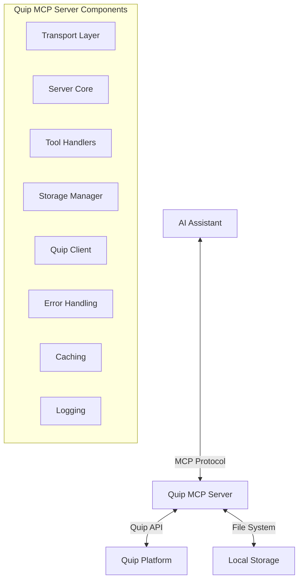

# System Patterns: Quip MCP Server

## System Architecture

The Quip MCP Server follows a modular architecture with clear separation of concerns, organized around the Model Context Protocol (MCP) standard. The architecture enables the server to act as a bridge between AI systems and Quip spreadsheet data.



### Core Components

1. **Transport Layer**
   - Handles communication protocols (stdio, HTTP)
   - Manages request/response formatting
   - Implements appropriate security for each transport

2. **Server Core**
   - Implements the MCP protocol
   - Registers capabilities and tools
   - Routes requests to appropriate handlers

3. **Tool Handlers**
   - Implements the specific tool logic (e.g., quip_read_spreadsheet)
   - Processes input parameters
   - Formats response data

4. **Storage Manager**
   - Handles persistence of spreadsheet data
   - Manages file paths and naming conventions
   - Provides resource URI generation

5. **Quip Client**
   - Interacts with the Quip API
   - Handles authentication
   - Implements export functionality and fallback methods

6. **Auxiliary Systems**
   - Error handling with specific error types
   - Caching for performance optimization
   - Logging for diagnostics and monitoring

## Key Technical Decisions

### TypeScript Implementation
- Provides strong typing for better code quality and maintainability
- Enables better IDE support and code navigation
- Facilitates easier onboarding for new developers

### Dual Transport Support
- **Stdio Transport**: For integration with AI platforms that launch the server as a subprocess
- **HTTP Transport**: For standalone operation and remote access
- Decision allows maximum flexibility for different deployment scenarios

### Local File Storage
- CSV files stored on local filesystem for persistence and quick retrieval
- Metadata stored alongside content for efficient querying
- Directory structure organized by thread IDs and sheet names

### Caching Strategy
- In-memory caching for frequently accessed resources
- Separate caches for content and metadata with different TTLs
- LRU (Least Recently Used) strategy to prevent memory issues

### Error Handling Approach
- Hierarchical error types for specific error scenarios
- Consistent error formatting for actionable feedback
- Detailed logging for troubleshooting

### Authentication Mechanisms
- API key authentication for HTTP transport
- Environment variables for sensitive credentials
- Optional automatic API key generation

## Design Patterns in Use

### Factory Pattern
Used in the storage implementation to create the appropriate storage instance based on configuration:

```typescript
export function createStorage(storageType: string, options: StorageOptions): StorageInterface {
  if (storageType === 'local') {
    return new LocalStorage(options.storagePath, options.isFileProtocol);
  }
  throw new Error(`Unsupported storage type: ${storageType}`);
}
```

### Strategy Pattern
Implemented for transport selection, allowing different communication protocols:

```typescript
// Choose transport based on options
if (options.port || process.env.PORT) {
  transport = new StreamableHTTPServerTransport({...});
} else {
  transport = new StdioServerTransport();
}
```

### Adapter Pattern
Used in the QuipClient to adapt the Quip API to the MCP server's needs:

```typescript
export class QuipClient {
  // Methods that abstract away Quip API details
  async getThread(threadId: string): Promise<Record<string, any>> {...}
  async exportThreadToXLSX(threadId: string, outputPath: string): Promise<string> {...}
  // etc.
}
```

### Singleton Pattern
Applied to logging and cache instances that should be shared across the application:

```typescript
// Created once and imported where needed
export const logger = createLogger();
export const csvCache = new LRUCache<string, string>(50, 10 * 60 * 1000); // 10 minutes TTL
export const metadataCache = new LRUCache<string, Record<string, any>>(100, 30 * 60 * 1000); // 30 minutes TTL
```

### Command Line Arguments Pattern
Structured approach to handling CLI arguments:

```typescript
export function parseCommandLineArgs(): CliOptions {
  // Using commander.js to parse command line arguments
  const program = new Command();
  program
    .option('--storage-path <path>', 'Path to store CSV files')
    .option('--file-protocol', 'Use file protocol for resource URIs')
    // etc.
}
```

## Component Relationships

### Data Flow
1. AI assistant makes a tool call via MCP protocol
2. Server processes the request and validates parameters
3. Tool handler delegates to QuipClient to retrieve data
4. QuipClient requests data from Quip API
5. Retrieved data is processed and stored by Storage manager
6. Response is formatted and returned via Transport layer

### Error Flow
1. Error occurs in any component
2. Specific error type is created with appropriate message
3. Error is logged with contextual information
4. Error is propagated back through the stack
5. Server formats error according to MCP protocol
6. Error response is sent back to client

### Resource URI Flow
1. Spreadsheet data is retrieved and stored
2. Storage manager generates appropriate URI (file:// or quip://)
3. URI is included in metadata
4. Client can request full resource using the URI
5. Server resolves URI to retrieve stored content

## Testing Approach

### Unit Testing
- Individual components tested in isolation
- Mock dependencies for controlled testing
- High coverage of core functionality

### Mock Mode
- Complete simulation of Quip API for testing without credentials
- Predefined sample data for consistent testing
- Toggle via command line or environment variable

### End-to-End Testing
- Example client demonstrates full workflow
- Tests both transport types
- Verifies correct handling of large datasets
